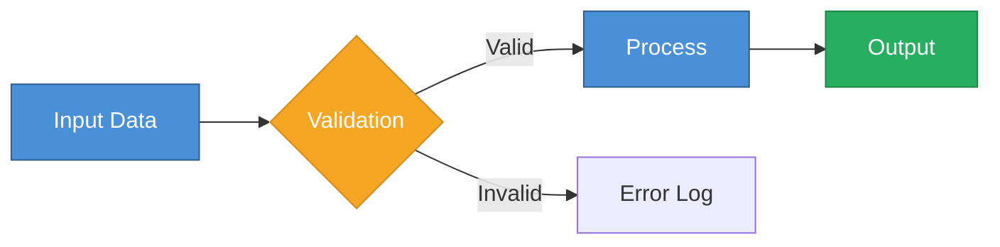
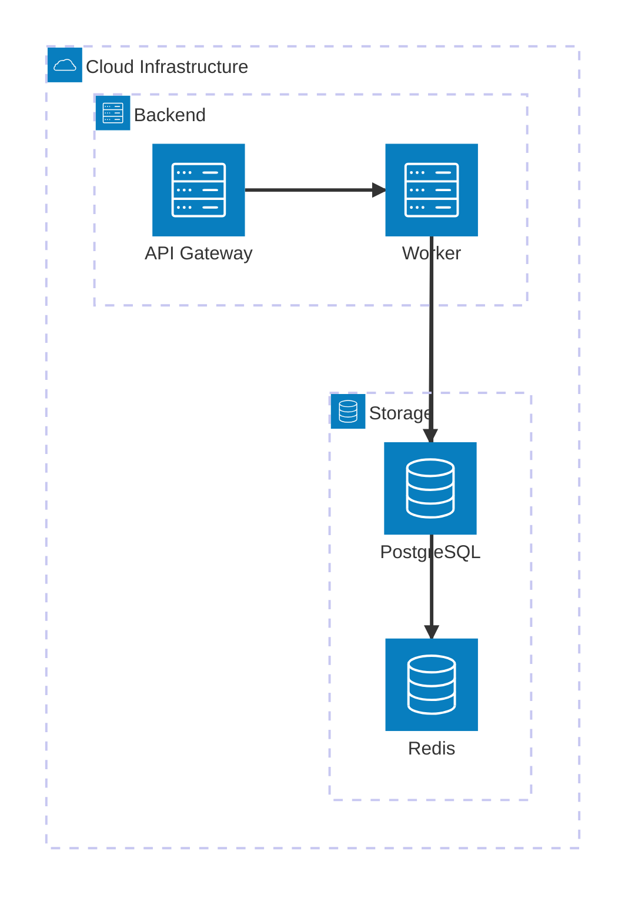
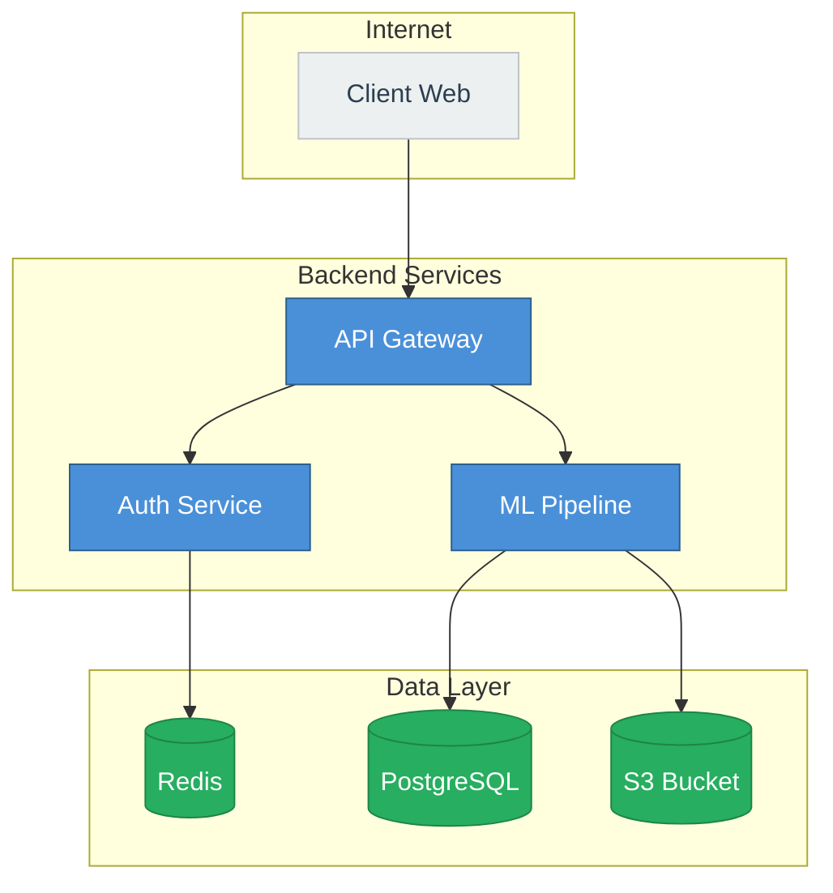
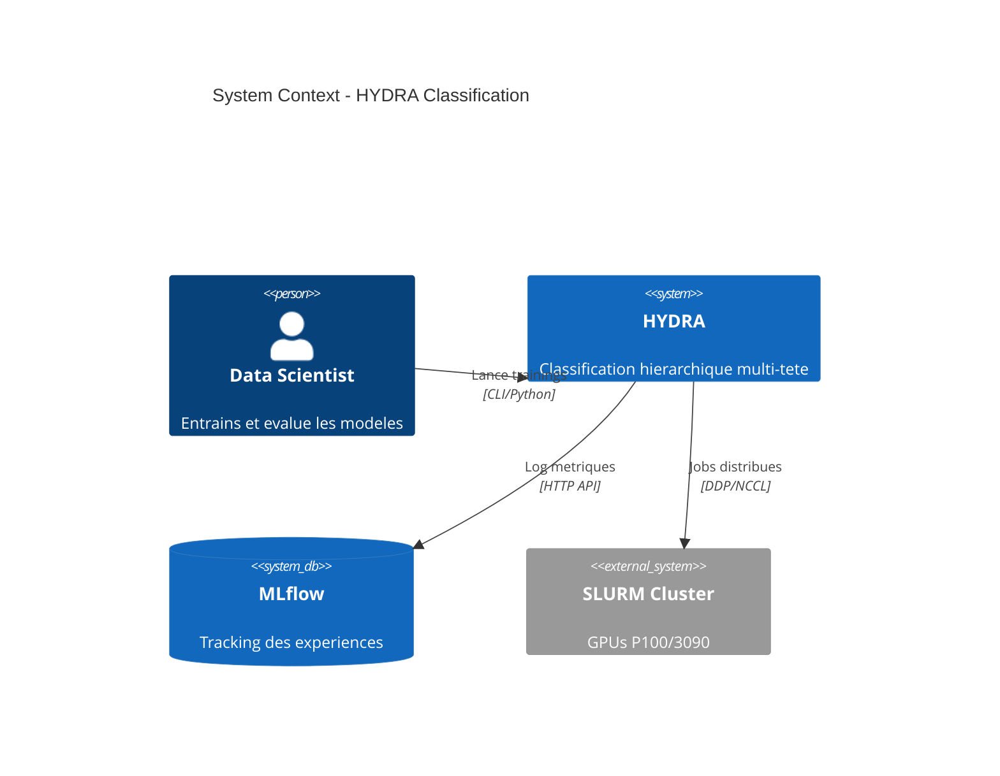
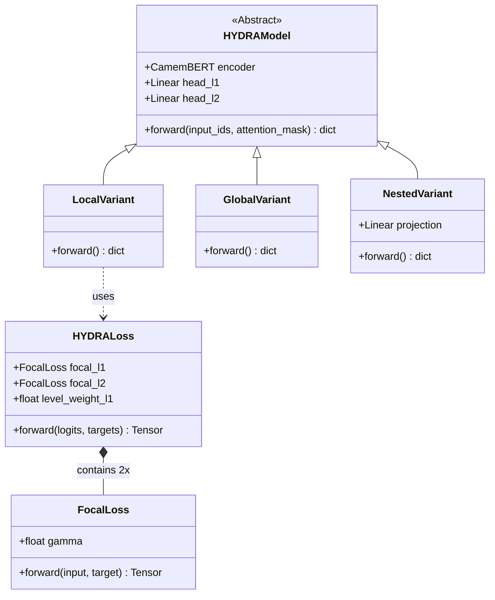
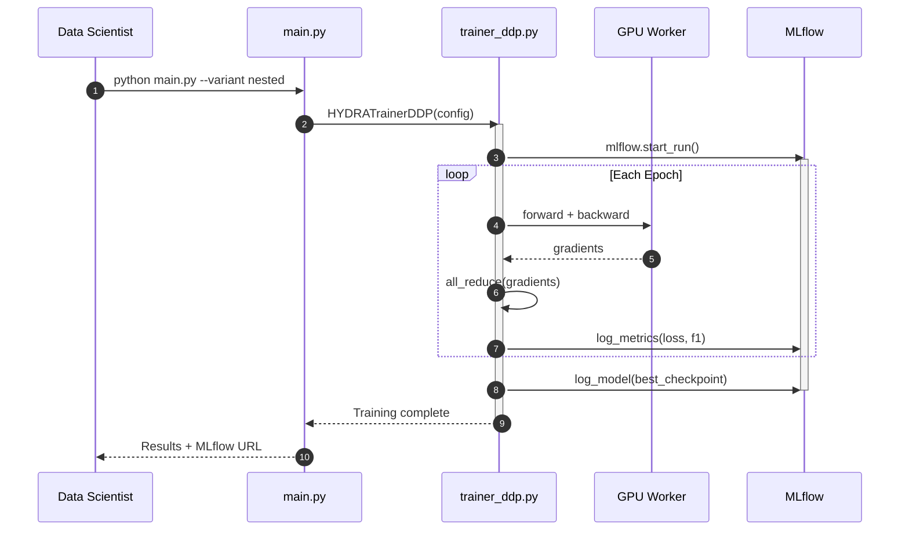
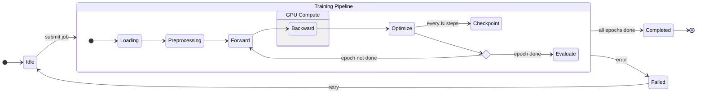
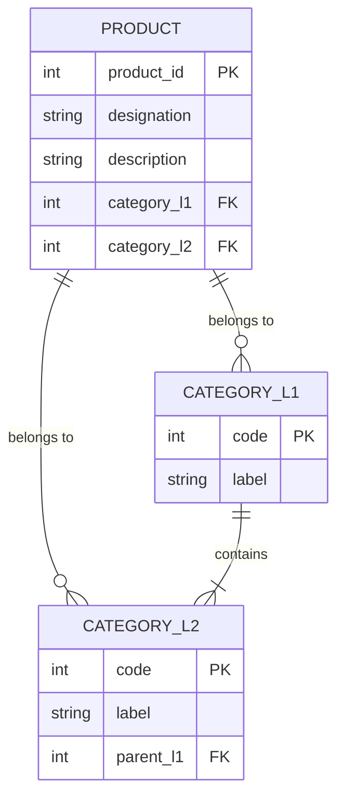
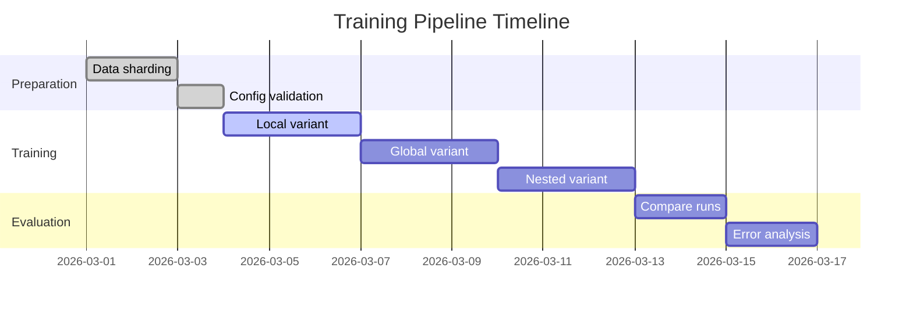

# Diagram Expert

Generation de diagrammes techniques professionnels en Mermaid (markdown) et draw.io XML.

## Arguments

- `$0` : format — `mermaid` ou `drawio`
- `$1` : type de diagramme — `flow`, `arch`, `class`, `sequence`, `state`, `c4`, `block`, `er`, `gantt`
- `$2` : chemin de sortie (optionnel). Si omis, affiche dans la conversation.

Exemples :
- `/diagram mermaid arch` — architecture en Mermaid, affiche dans le chat
- `/diagram drawio flow pipeline.drawio` — flowchart draw.io, ecrit dans le fichier
- `/diagram mermaid class 02_hydra/docs/classes.md` — diagramme de classes dans un fichier

## Taches

### 1. Comprendre le besoin

Si l'utilisateur n'a pas decrit le diagramme voulu :
- Demander : quel systeme/processus representer ?
- Proposer le type de diagramme le plus adapte
- Confirmer le niveau de detail (overview vs detailed)

Si l'utilisateur a decrit le diagramme ou fourni du code source :
- Analyser le code/la description
- Choisir le type de diagramme automatiquement
- Generer directement

### 2. Generer le diagramme

Appliquer les regles de style du format choisi (voir sections ci-dessous).

### 3. Ecrire ou afficher

- Si `$2` est fourni : ecrire avec `Write` dans le fichier
- Sinon : afficher le diagramme dans un bloc de code dans la conversation

---

## Format : Mermaid

### Regles generales

- Toujours commencer par le type de diagramme : `flowchart LR`, `classDiagram`, `sequenceDiagram`, etc.
- Direction par defaut : `LR` (gauche a droite) pour les flux, `TD` (haut en bas) pour les hierarchies
- Noms de nodes : courts, descriptifs, en camelCase ou avec espaces entre guillemets
- Labels sur les fleches pour les relations importantes
- Subgraphs pour grouper les composants logiques
- Styling avec `classDef` pour la coherence visuelle (pas de styles inline)
- Commentaires `%%` pour les sections complexes

### Palette de couleurs professionnelle

```
classDef primary fill:#4A90D9,stroke:#2C5F8A,color:#fff
classDef secondary fill:#7B68EE,stroke:#5B4BC7,color:#fff
classDef accent fill:#F5A623,stroke:#D4891A,color:#fff
classDef success fill:#27AE60,stroke:#1E8449,color:#fff
classDef danger fill:#E74C3C,stroke:#C0392B,color:#fff
classDef neutral fill:#ECF0F1,stroke:#BDC3C7,color:#2C3E50
classDef dark fill:#2C3E50,stroke:#1A252F,color:#fff
```

### Type : Flowchart (`flow`)

Pour les pipelines, processus, workflows.



**Shapes a utiliser :**

| Forme | Syntaxe | Usage |
|:------|:--------|:------|
| Rectangle | `[texte]` | Etapes, composants |
| Arrondi | `(texte)` | Debut/fin, services |
| Losange | `{texte}` | Decisions, conditions |
| Cylindre | `[(texte)]` | Bases de donnees |
| Stade | `([texte])` | Actions utilisateur |
| Hexagone | `{{texte}}` | Preparatifs, configs |
| Parallelogramme | `[/texte/]` | Entrees/sorties |
| Double cercle | `(((texte)))` | Evenements |

**Fleches :**

| Style | Syntaxe | Usage |
|:------|:--------|:------|
| Standard | `-->` | Flux principal |
| Avec label | `-->\|label\|` | Flux conditionnel |
| Pointille | `-.->` | Dependance faible |
| Epais | `==>` | Flux critique |
| Bidirectionnel | `<-->` | Echange |
| Invisible | `~~~` | Alignement layout |

### Type : Architecture (`arch`)

Pour les architectures systeme, cloud, microservices.

**Option 1 — Mermaid Architecture Diagram (recommande pour les vues systeme) :**



Icons disponibles par defaut : `cloud`, `database`, `disk`, `internet`, `server`.

**Option 2 — Flowchart stylise (plus flexible) :**



**Option 3 — C4 Model (pour l'architecture logicielle formelle) :**



Niveaux C4 :
- `C4Context` : vue systeme (personnes + systemes)
- `C4Container` : vue conteneurs (services, DBs, apps)
- `C4Component` : vue composants (classes, modules)
- `C4Deployment` : vue deploiement (nodes, infra)

### Type : Class Diagram (`class`)

Pour les structures de code, hierarchies de classes, patterns.



**Relations :**

| Type | Syntaxe | Signification |
|:-----|:--------|:--------------|
| Heritage | `<\|--` | Extends / implements |
| Composition | `*--` | Fait partie de (vie liee) |
| Aggregation | `o--` | Contient (vie independante) |
| Association | `-->` | Utilise |
| Dependance | `..>` | Depend faiblement |
| Realisation | `..\|>` | Implemente interface |

**Visibilite :** `+` public, `-` private, `#` protected, `~` package

**Annotations :** `<<Abstract>>`, `<<Interface>>`, `<<Service>>`, `<<Enumeration>>`

### Type : Sequence Diagram (`sequence`)

Pour les flux d'execution, interactions entre composants.



**Types de fleches :**

| Style | Syntaxe | Usage |
|:------|:--------|:------|
| Synchrone | `->>` | Appel bloquant |
| Retour | `-->>` | Reponse |
| Asynchrone | `-)` | Fire-and-forget |
| Pointille | `-->` | Optionnel |
| Croix | `-x` | Echec |

**Blocs de controle :** `loop`, `alt/else`, `opt`, `par/and`, `critical/option`, `break`, `rect`

### Type : State Diagram (`state`)

Pour les machines a etats, cycles de vie.



**Elements speciaux :**
- `<<choice>>` : point de decision
- `<<fork>>` / `<<join>>` : parallelisme
- `--` dans un etat composite : concurrence

### Type : Block Diagram (`block`)

Pour les architectures en couches, layouts personnalises.

```mermaid
block-beta
    columns 3

    space:1 title["HYDRA Architecture"]:1 space:1

    subgraph encoder["Encoder"]
        columns 1
        tok["Tokenizer\n(B, 128)"]
        bert["CamemBERT\n(B, 768)"]
    end

    space:1

    subgraph heads["Classification Heads"]
        columns 1
        h1["Head L1\n157 classes"]
        h2["Head L2\n6100 classes"]
    end

    encoder --> heads

    style encoder fill:#4A90D9,stroke:#2C5F8A,color:#fff
    style heads fill:#27AE60,stroke:#1E8449,color:#fff
```

### Type : Entity-Relationship (`er`)

Pour les schemas de donnees.



### Type : Gantt (`gantt`)

Pour les plannings, roadmaps.



---

## Format : draw.io XML

### Structure XML de base

Un fichier `.drawio` suit cette structure :

```xml
<mxfile host="app.diagrams.net" modified="2026-03-13">
  <diagram id="diag1" name="Page-1">
    <mxGraphModel dx="1422" dy="762" grid="1" gridSize="10"
                  guides="1" tooltips="1" connect="1" arrows="1"
                  fold="1" page="1" pageScale="1"
                  pageWidth="1169" pageHeight="827">
      <root>
        <mxCell id="0"/>
        <mxCell id="1" parent="0"/>

        <!-- Nodes et edges ici -->

      </root>
    </mxGraphModel>
  </diagram>
</mxfile>
```

### Elements

**Vertex (noeud/forme) :**

```xml
<mxCell id="2" value="API Gateway" style="rounded=1;whiteSpace=wrap;html=1;fillColor=#4A90D9;strokeColor=#2C5F8A;fontColor=#FFFFFF;fontSize=14;fontStyle=1;" vertex="1" parent="1">
  <mxGeometry x="200" y="100" width="160" height="60" as="geometry"/>
</mxCell>
```

**Edge (connexion) :**

```xml
<mxCell id="10" value="HTTP" style="edgeStyle=orthogonalEdgeStyle;rounded=1;orthogonalLoop=1;jettySize=auto;html=1;strokeWidth=2;strokeColor=#2C3E50;" edge="1" source="2" target="3" parent="1">
  <mxGeometry relative="1" as="geometry"/>
</mxCell>
```

**Group (conteneur) :**

```xml
<mxCell id="20" value="Backend Services" style="group;rounded=1;fillColor=#F0F4F8;strokeColor=#BDC3C7;strokeWidth=2;fontSize=16;fontStyle=1;verticalAlign=top;spacingTop=10;" vertex="1" parent="1">
  <mxGeometry x="100" y="80" width="400" height="300" as="geometry"/>
</mxCell>
<!-- Enfants avec parent="20" -->
<mxCell id="21" value="Service A" style="..." vertex="1" parent="20">
  <mxGeometry x="20" y="40" width="120" height="50" as="geometry"/>
</mxCell>
```

### Styles de formes professionnels

```
# Rectangle arrondi (composant)
rounded=1;whiteSpace=wrap;html=1;fillColor=#4A90D9;strokeColor=#2C5F8A;fontColor=#FFFFFF;fontSize=13;fontStyle=1;arcSize=12;

# Cylindre (base de donnees)
shape=cylinder3;whiteSpace=wrap;html=1;boundedLbl=1;backgroundOutline=1;size=15;fillColor=#27AE60;strokeColor=#1E8449;fontColor=#FFFFFF;fontSize=13;

# Losange (decision)
rhombus;whiteSpace=wrap;html=1;fillColor=#F5A623;strokeColor=#D4891A;fontColor=#FFFFFF;fontSize=12;

# Cloud (service externe)
ellipse;shape=cloud;whiteSpace=wrap;html=1;fillColor=#ECF0F1;strokeColor=#BDC3C7;fontSize=13;

# Document
shape=document;whiteSpace=wrap;html=1;boundedLbl=1;backgroundOutline=1;size=0.27;fillColor=#F5F5F5;strokeColor=#666666;

# Hexagone (process)
shape=hexagon;perimeter=hexagonPerimeter2;whiteSpace=wrap;html=1;fixedSize=1;size=25;fillColor=#7B68EE;strokeColor=#5B4BC7;fontColor=#FFFFFF;

# Image (icone)
shape=image;verticalLabelPosition=bottom;labelBackgroundColor=default;verticalAlign=top;aspect=fixed;imageAspect=0;image=url_to_icon;
```

### Styles de connexions

```
# Orthogonal (angle droit)
edgeStyle=orthogonalEdgeStyle;rounded=1;orthogonalLoop=1;jettySize=auto;html=1;strokeWidth=2;strokeColor=#2C3E50;

# Courbe
edgeStyle=entityRelationEdgeStyle;rounded=1;html=1;strokeWidth=2;strokeColor=#2C3E50;

# Droite
edgeStyle=none;html=1;strokeWidth=2;strokeColor=#2C3E50;

# Pointille
edgeStyle=orthogonalEdgeStyle;dashed=1;dashPattern=8 4;strokeWidth=1;strokeColor=#95A5A6;

# Fleche epaisse (flux principal)
edgeStyle=orthogonalEdgeStyle;rounded=1;strokeWidth=3;strokeColor=#2C3E50;endArrow=blockThin;endFill=1;

# Bidirectionnel
edgeStyle=orthogonalEdgeStyle;rounded=1;strokeWidth=2;startArrow=blockThin;startFill=1;endArrow=blockThin;endFill=1;
```

### Palette de couleurs

| Usage | Fill | Stroke | Font |
|:------|:-----|:-------|:-----|
| Primary (compute) | `#4A90D9` | `#2C5F8A` | `#FFFFFF` |
| Secondary (logic) | `#7B68EE` | `#5B4BC7` | `#FFFFFF` |
| Accent (attention) | `#F5A623` | `#D4891A` | `#FFFFFF` |
| Success (data/storage) | `#27AE60` | `#1E8449` | `#FFFFFF` |
| Danger (error/alert) | `#E74C3C` | `#C0392B` | `#FFFFFF` |
| Neutral (external) | `#ECF0F1` | `#BDC3C7` | `#2C3E50` |
| Dark (infrastructure) | `#2C3E50` | `#1A252F` | `#FFFFFF` |
| Background (group) | `#F0F4F8` | `#BDC3C7` | `#2C3E50` |

### Layout grid

- Espacement horizontal entre noeuds : **200px**
- Espacement vertical entre noeuds : **100px**
- Taille standard des noeuds : **160x60px**
- Taille des groupes : adapter a `(nb_enfants * 180 + 40)` x `(nb_rangees * 100 + 60)`
- Marges dans les groupes : **20px** lateral, **40px** haut (pour le titre)

### Exemple complet : Architecture HYDRA

```xml
<mxfile host="app.diagrams.net" modified="2026-03-13">
  <diagram id="hydra-arch" name="HYDRA Architecture">
    <mxGraphModel dx="1422" dy="762" grid="1" gridSize="10" guides="1" tooltips="1" connect="1" arrows="1" fold="1" page="1" pageScale="1" pageWidth="1169" pageHeight="827">
      <root>
        <mxCell id="0"/>
        <mxCell id="1" parent="0"/>

        <!-- Input -->
        <mxCell id="input" value="&lt;b&gt;Input&lt;/b&gt;&lt;br&gt;designation + description" style="rounded=1;whiteSpace=wrap;html=1;fillColor=#ECF0F1;strokeColor=#BDC3C7;fontSize=12;" vertex="1" parent="1">
          <mxGeometry x="40" y="200" width="160" height="60" as="geometry"/>
        </mxCell>

        <!-- Tokenizer -->
        <mxCell id="tok" value="&lt;b&gt;Tokenizer&lt;/b&gt;&lt;br&gt;(B, 128)" style="rounded=1;whiteSpace=wrap;html=1;fillColor=#7B68EE;strokeColor=#5B4BC7;fontColor=#FFFFFF;fontSize=12;" vertex="1" parent="1">
          <mxGeometry x="260" y="200" width="140" height="60" as="geometry"/>
        </mxCell>

        <!-- Encoder -->
        <mxCell id="enc" value="&lt;b&gt;CamemBERT&lt;/b&gt;&lt;br&gt;(B, 768)" style="rounded=1;whiteSpace=wrap;html=1;fillColor=#4A90D9;strokeColor=#2C5F8A;fontColor=#FFFFFF;fontSize=13;fontStyle=1;" vertex="1" parent="1">
          <mxGeometry x="460" y="190" width="160" height="80" as="geometry"/>
        </mxCell>

        <!-- Head L1 -->
        <mxCell id="h1" value="&lt;b&gt;Head L1&lt;/b&gt;&lt;br&gt;157 classes" style="rounded=1;whiteSpace=wrap;html=1;fillColor=#27AE60;strokeColor=#1E8449;fontColor=#FFFFFF;fontSize=12;" vertex="1" parent="1">
          <mxGeometry x="700" y="140" width="140" height="60" as="geometry"/>
        </mxCell>

        <!-- Head L2 -->
        <mxCell id="h2" value="&lt;b&gt;Head L2&lt;/b&gt;&lt;br&gt;6100+ classes" style="rounded=1;whiteSpace=wrap;html=1;fillColor=#27AE60;strokeColor=#1E8449;fontColor=#FFFFFF;fontSize=12;" vertex="1" parent="1">
          <mxGeometry x="700" y="260" width="140" height="60" as="geometry"/>
        </mxCell>

        <!-- Loss -->
        <mxCell id="loss" value="&lt;b&gt;HYDRALoss&lt;/b&gt;&lt;br&gt;FocalLoss (gamma=2.0)" style="rounded=1;whiteSpace=wrap;html=1;fillColor=#F5A623;strokeColor=#D4891A;fontColor=#FFFFFF;fontSize=12;" vertex="1" parent="1">
          <mxGeometry x="920" y="200" width="180" height="60" as="geometry"/>
        </mxCell>

        <!-- Edges -->
        <mxCell id="e1" style="edgeStyle=orthogonalEdgeStyle;rounded=1;strokeWidth=2;strokeColor=#2C3E50;endArrow=blockThin;endFill=1;" edge="1" source="input" target="tok" parent="1">
          <mxGeometry relative="1" as="geometry"/>
        </mxCell>

        <mxCell id="e2" style="edgeStyle=orthogonalEdgeStyle;rounded=1;strokeWidth=2;strokeColor=#2C3E50;endArrow=blockThin;endFill=1;" edge="1" source="tok" target="enc" parent="1">
          <mxGeometry relative="1" as="geometry"/>
        </mxCell>

        <mxCell id="e3" style="edgeStyle=orthogonalEdgeStyle;rounded=1;strokeWidth=2;strokeColor=#2C3E50;endArrow=blockThin;endFill=1;" edge="1" source="enc" target="h1" parent="1">
          <mxGeometry relative="1" as="geometry"/>
        </mxCell>

        <mxCell id="e4" style="edgeStyle=orthogonalEdgeStyle;rounded=1;strokeWidth=2;strokeColor=#2C3E50;endArrow=blockThin;endFill=1;" edge="1" source="enc" target="h2" parent="1">
          <mxGeometry relative="1" as="geometry"/>
        </mxCell>

        <mxCell id="e5" style="edgeStyle=orthogonalEdgeStyle;rounded=1;strokeWidth=2;strokeColor=#F5A623;endArrow=blockThin;endFill=1;" edge="1" source="h1" target="loss" parent="1">
          <mxGeometry relative="1" as="geometry"/>
        </mxCell>

        <mxCell id="e6" style="edgeStyle=orthogonalEdgeStyle;rounded=1;strokeWidth=2;strokeColor=#F5A623;endArrow=blockThin;endFill=1;" edge="1" source="h2" target="loss" parent="1">
          <mxGeometry relative="1" as="geometry"/>
        </mxCell>

      </root>
    </mxGraphModel>
  </diagram>
</mxfile>
```

---

## Bonnes pratiques

### Lisibilite

1. **Max 12-15 noeuds** par diagramme. Au-dela, decouper en sous-diagrammes.
2. **Labels courts** : max 3-4 mots par noeud, details dans les labels d'aretes.
3. **Hierarchie visuelle** : les composants importants sont plus gros ou plus colores.
4. **Flux gauche-droite** pour les pipelines (LR), **haut-en-bas** pour les hierarchies (TD).
5. **Grouper** les composants lies dans des subgraphs/groupes.

### Couleurs

1. **Max 4-5 couleurs** par diagramme. Chaque couleur = un role semantique.
2. **Coherence** : meme couleur = meme type de composant dans tout le diagramme.
3. **Contraste** : texte blanc sur fond sombre, texte sombre sur fond clair.
4. **Pas de rouge** sauf pour les erreurs/alertes.

### Connecteurs

1. **Direction coherente** : tous les flux principaux dans le meme sens.
2. **Eviter les croisements** : reorganiser les noeuds si necessaire.
3. **Fleches differenciees** : plein = flux principal, pointille = dependance faible, epais = critique.
4. **Labels** uniquement sur les connexions non-evidentes.

### Choix du format

| Besoin | Format recommande |
|:-------|:------------------|
| Integrer dans un README GitHub | Mermaid (rendu natif) |
| Integrer dans un blog/docs | Mermaid |
| Presentation PowerPoint / PDF | draw.io (export PNG/SVG) |
| Documentation architecture formelle | draw.io ou Mermaid C4 |
| Diagramme editable par l'equipe | draw.io (`.drawio` dans le repo) |
| Diagramme dans du code/commentaires | Mermaid |

### Choix du type

| Besoin | Type recommande |
|:-------|:----------------|
| Pipeline de donnees, workflow | `flow` |
| Architecture systeme, infra | `arch` ou `c4` |
| Structure du code, heritage | `class` |
| Interactions entre composants | `sequence` |
| Cycle de vie, etats | `state` |
| Schema de donnees | `er` |
| Planning, roadmap | `gantt` |
| Layout personnalise, couches | `block` |
