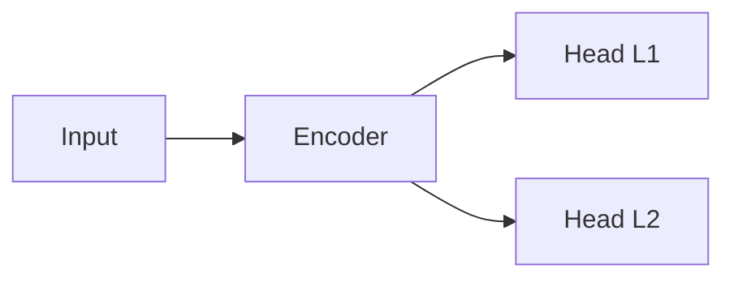

# Markdown Expert

Generation et amelioration de contenu Markdown technique de qualite professionnelle.

## Arguments

- `$0` : action — `write <path>`, `improve <path>`, `review <path>`, `template <type>`
- Actions :
  - `write <path>` : creer un nouveau document markdown a partir d'instructions
  - `improve <path>` : ameliorer un fichier markdown existant (structure, style, lisibilite)
  - `review <path>` : audit qualite d'un fichier markdown avec score et recommandations
  - `template <type>` : generer un squelette (`readme`, `spec`, `report`, `blog`, `api`, `changelog`)

## Regles de style

Suivre strictement ces regles (basees sur Google Markdown Style Guide + best practices).

### Structure du document

1. **Un seul H1** : titre du document, premiere ligne
2. **Introduction** : 1-3 phrases immediatement apres le H1
3. **Hierarchie stricte** : H1 > H2 > H3 > H4, jamais sauter un niveau
4. **Sections courtes** : max 3-4 paragraphes par section avant un nouveau heading
5. **Conclusion / Next Steps** en fin de document si pertinent

### Headings

- Style ATX uniquement (`#`, `##`, `###`)
- Ligne vide avant ET apres chaque heading
- Pas de ponctuation finale dans les headings
- Capitalisation : Title Case pour H1-H2, Sentence case pour H3+
- Noms uniques et descriptifs (pas de "Introduction" generique si possible)

### Paragraphes et texte

- Limite 80 caracteres par ligne (sauf liens, tableaux, blocs de code)
- Une idee par paragraphe
- Ligne vide entre chaque paragraphe
- Pas de trailing whitespace
- Gras (`**bold**`) pour les termes importants ou definitions
- Italique (`*italic*`) pour emphase legere ou titres d'oeuvres
- Inline code (`` `code` ``) pour : noms de fichiers, commandes, variables, valeurs

### Listes

- **A puces** : pour collections sans ordre
- **Numerotees** : pour sequences, etapes, classements
- Lazy numbering (`1.` partout) pour les longues listes modifiables
- Indentation 4 espaces pour les sous-listes
- Chaque item commence par une majuscule
- Pas de ponctuation finale sauf si phrases completes (alors point pour tous)
- Parallélisme grammatical : tous les items commencent par le meme type de mot

### Blocs de code

- Toujours utiliser les fences (` ``` `) jamais l'indentation 4 espaces
- Toujours declarer le langage : ` ```python `, ` ```bash `, ` ```yaml `
- Commandes longues : `\` pour echapper les retours a la ligne
- Pas de `$` en prefix des commandes bash (sauf si mix commande/output)
- Garder les exemples de code minimaux et executables

### Tableaux

- Utiliser UNIQUEMENT pour des donnees tabulaires (pas pour du layout)
- Aligner les pipes `|` pour lisibilite du source
- Header avec separateur `|---|`
- Cellules concises (max ~30 caracteres)
- Alignement : `:---` gauche, `:---:` centre, `---:` droite
- Si >5 colonnes ou cellules longues : preferer une liste ou un bloc de code

Exemple de tableau bien formate :

```markdown
| Composant     | Role                    | Fichier            |
|:--------------|:------------------------|:-------------------|
| Encoder       | Extraction features     | `models.py`        |
| Loss          | FocalLoss hierarchique  | `losses.py`        |
| Trainer       | Boucle d'entrainement   | `trainer.py`       |
```

### Liens

- Texte descriptif : `[guide d'installation](install.md)` pas `[cliquez ici](install.md)`
- Liens reference pour URLs longues ou repetees :

```markdown
Voir le [guide de style][google-style] pour les details.

[google-style]: https://google.github.io/styleguide/docguide/style.html
```

- Chemins relatifs dans le meme repo, absolus pour l'externe
- Pas d'URLs nus dans le texte (toujours wrappees `[texte](url)` ou `<url>`)

### Images

- Alt text toujours present et descriptif
- Format : ``
- Preferer les diagrammes texte (Mermaid, ASCII) aux images quand possible

### Diagrammes

Privilegier les diagrammes en texte pour la maintenabilite :

**Mermaid** (si le renderer supporte) :

````markdown

````

**ASCII art** pour compatibilite universelle :

```
Input --> [Encoder] --> +-- [Head L1] --> 157 classes
                        |
                        +-- [Head L2] --> 6100 classes
```

**Tableaux comme diagrammes** pour les architectures simples :

```markdown
| Etape | Composant          | Sortie             |
|:-----:|:-------------------|:-------------------|
| 1     | Tokenizer          | `(B, 128)` tokens  |
| 2     | CamemBERT encoder  | `(B, 768)` hidden  |
| 3     | Head L1            | `(B, 157)` logits  |
| 4     | Head L2            | `(B, 6100)` logits |
```

### Sections speciales

**Admonitions** (si le renderer supporte) :

```markdown
> **Note** : Information complementaire.

> **Warning** : Point d'attention critique.

> **Tip** : Astuce pour gagner du temps.
```

**Badges** (pour READMEs) :

```markdown


```

**Table des matieres** : generer automatiquement si >4 sections H2.

## Taches par action

### Action `write`

1. Demander le sujet, l'audience cible, et le niveau de detail souhaite
2. Proposer un outline (liste de sections H2/H3)
3. Rediger section par section en appliquant toutes les regles
4. Ecrire avec `Write` dans le fichier cible
5. Relire et verifier la conformite aux regles

### Action `improve`

1. Lire le fichier avec `Read`
2. Evaluer selon la checklist qualite (voir ci-dessous)
3. Appliquer les corrections avec `Edit` :
   - Restructurer les headings si hierarchie cassee
   - Reformater les tableaux (alignement pipes)
   - Ajouter les langages aux blocs de code
   - Corriger le style des listes (parallelisme, indentation)
   - Remplacer les liens generiques par du texte descriptif
   - Ajouter alt text aux images
   - Couper les paragraphes trop longs
4. Presenter un diff des changements effectues

### Action `review`

1. Lire le fichier avec `Read`
2. Evaluer chaque critere de la checklist :

| #  | Critere                              | Poids |
|:---|:-------------------------------------|:-----:|
| 1  | Hierarchie headings correcte         | 10    |
| 2  | Introduction presente et claire      | 5     |
| 3  | Blocs de code avec langage declare   | 10    |
| 4  | Tableaux bien formates et alignes    | 10    |
| 5  | Listes avec parallelisme grammatical | 8     |
| 6  | Liens descriptifs (pas "cliquez ici")| 5     |
| 7  | Images avec alt text                 | 5     |
| 8  | Pas de trailing whitespace           | 3     |
| 9  | Ligne vide avant/apres headings      | 5     |
| 10 | Pas de HTML inline                   | 5     |
| 11 | Sections de taille equilibree        | 7     |
| 12 | Diagrammes en texte si possible      | 7     |
| 13 | TOC si >4 sections H2                | 5     |
| 14 | Coherence du style (gras, italique)  | 5     |
| 15 | Limite ~80 chars respectee           | 10    |

3. Calculer le score /100
4. Presenter le rapport :

```markdown
## Markdown Review: [fichier]

**Score : XX/100**

| Critere | Score | Commentaire |
|:--------|:-----:|:------------|
| ...     | X/10  | ...         |

### Recommandations prioritaires
1. ...
2. ...
3. ...
```

### Action `template`

Generer un squelette pret a remplir selon le type :

**`readme`** :
```
# Nom du Projet
Badges
Introduction (1-3 phrases)
## Features
## Quick Start
## Installation
## Usage
## Configuration
## Architecture
## Contributing
## License
```

**`spec`** :
```
# [Feature] — Technical Specification
## Context
## Goals & Non-Goals
## Design
### Architecture
### API
### Data Model
## Alternatives Considered
## Migration Plan
## Open Questions
```

**`report`** :
```
# [Sujet] — Report
## Executive Summary
## Methodology
## Results
## Analysis
## Recommendations
## Appendix
```

**`blog`** :
```
# [Titre]
Introduction accrocheuse
## The Problem
## Our Approach
## Implementation
## Results
## Lessons Learned
## What's Next
```

**`api`** :
```
# API Reference
## Authentication
## Endpoints
### `GET /resource`
### `POST /resource`
## Error Codes
## Rate Limits
## Examples
```

**`changelog`** :
```
# Changelog
## [Unreleased]
### Added
### Changed
### Fixed
### Removed
## [1.0.0] — YYYY-MM-DD
### Added
```
